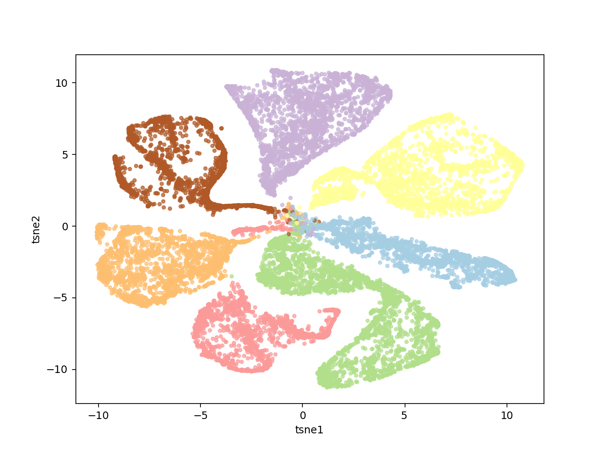
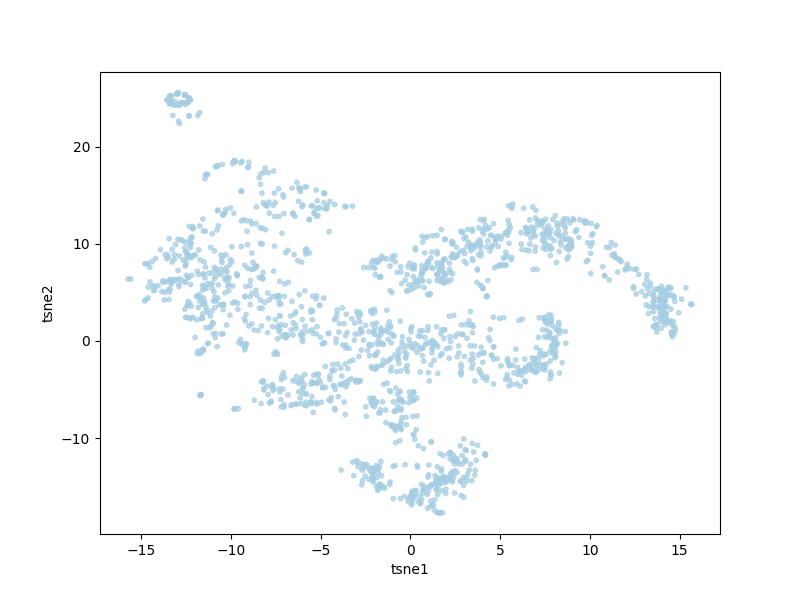
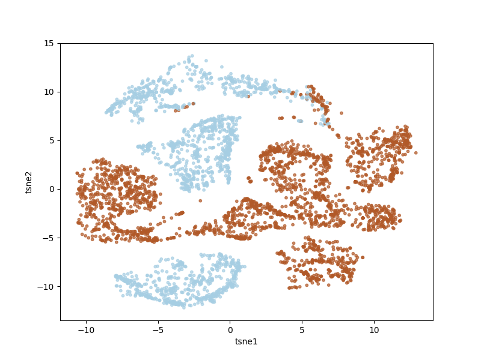

shadowverseのデッキクラスタをt-sneで見てみる  
以前かいたfasttextを使ってクラスタリングが出来るんじゃないかと思い書いてみました  

### データ取得
-----------
Cygames公式のデッキ構築用サイト[https://shadowverse-portal.com/](https://shadowverse-portal.com/)からデッキ情報を取ります  
と言っても、他人が作ったデッキの検索機能はないので、twitterに投稿された共有用のURLからデッキを復元します    
~~~
@~~~~
https://shadowverse-portal.com/deck/1.4.62sZ2.62sZ2.62sZ2.5_394.5_394.5_394.62sac.62sac.6I772.6I772.6I772.6LxG2.6LxG2.6LxG2.5_38w.5_38w.5_38w.62vkA.62vkA.62vkA.6AaSQ.6AaSQ.6AaSQ.68zBM.68zBM.6KPc2.6KPc2.62sZM.62sZM.62sZM.6EI-M.6EI-M.6EI-M.6M2ao.6M2ao.6M2ao.6EQIo.6EQIo.6EQIo.61SE6 
原初サタン組んで見ました。意見募集してます
~~~
↓ URLから取れる情報はこちら  
~~~
1.4 → キャラクターID
62sZ2-61SE6　→ カードID(.で区切られカード枚数分書かれている)
~~~
 
キャラクターID一覧  
~~~
1.1 → エルフ,アリサ
1.2 → ロイヤル,エリカ
1.3 → ウィッチ,イザネル
1.4 → ドラゴン,ローウェン
1.5 → ネクロマンサー,ルナ
1.6 → ヴァンパイア,ユリアス
1.7 → ビショップ,イリス  
~~~
こちらのデータをTwitter SearchAPIで3000件ほど取得   
直近2週間しかとれないようなので数を揃えようとすると時間が掛かります  
 

### fasttextでカードを分散表現に変換する
-----------

fasttextで文章を学習するときように、カードIDを区切ってデータに出力します
~~~
63E_G 63E_G 63FiQ 63FiQ 63FiQ 63HfQ 63HfQ 6Avi6 6Avi6 6EmHC 6EmHC 6Ei7Q 6Ei7Q 63HQQ 63HQQ 6AtG0 63Kb4 63Kb4 673s2 673s2 6At-a 6At-a 6EojI 6EojI 6EojI 63Kaw 63Kaw 63HQu 63HQu 63MII 63MII 67370 63JsW 63JsW 63KbE 63KbE 6AviG 6AviG 6EmHM 6EmHM
5_394 5_394 5_394 62sac 62sac 66giC 66giC 66giC 6AaSQ 6AaSQ 6AaSQ 5zbeY 5zbeY 5zbeY 5_39E 5_39E 6ELQm 6ELQm 6ELQm 6AY0A 6AY0A 6AY0A 62xRs 62xRs 62xRs 6ENsi 6ENsi 6ENsi 5_4sS 5_4sS 5_4sS 5_5bA 5_5bA 62saI 62saI 62zto 62zto 694Vo 694Vo 694Vo
~~~

次元数は時に気にしてなかったので200ぐらいでやりました  
~~~sh
./fasttext.exe skipgram -input deck.dat -output ../fastTextJapaneseTutorial/model -dim 200
~~~
ID,vecが対になったmodel.vecが出力されるので、これを使用します  
 

### t-sneにつっこむ
----------------
各デッキ情報とカードの分散表現が取れたので、デッキ毎の分散表現を作ります  
今回はそのまま、デッキに組み込まれているカードのベクトルを加算したものを使用しました  

デッキ毎のベクトルが取れるのでt-sneに入れて2次元にプロット  

### 全デッキ

### ウィッチ

左上と右端、下に塊があります  
- 左上のデッキ(全部同じデッキ テンプレ？)  
[デッキ](https://shadowverse-portal.com/deck/1.3.66IXe.66IXe.66IXe.6HkyA.6HkyA.6HkyA.6A8t6.6A8t6.6A8t6.6Dz06.6Dz06.6Dz06.66NA2.66NA2.66NA2.66IXo.66IXo.66IXo.6DwZs.6DwZs.6DwZs.6A79Q.6A79Q.6A79Q.6HpbC.6HpbC.6HpbC.6Dwa0.6Dwa0.6Dwa0.6A9bg.6A9bg.6A9bg.6Hs1I.6Hs1I.6Hs1I.6E0Aw.6E0Aw.659nE.659nE)

- 右端のデッキ  
[デッキ](https://shadowverse-portal.com/deck/1.3.5zWm2.5zWm2.5zWm2.65BUS.65BUS.65BUS.68_dc.68_dc.6GdvI.6GdvI.6GdvI.66NA2.66NA2.6HkiY.6HkiY.6HkiY.6CsCi.6CsCi.6CsCi.6GbTM.6GbTM.6GbTM.6Gino.6Gino.6Gino.61LeE.6A9bg.6A9bg.6A9bg.659nE.659nE.659nE.6Hpb2.6Hpb2.6Hpb2.6Hs1I.6Hs1I.6Hs1I.6E0Aw.6E0Aw)
[デッキ](https://shadowverse-portal.com/deck/1.3.61O4A.61O4A.61O4A.5-gkQ.5-gkQ.5-gkQ.66NA2.66NA2.66NA2.6A6Qs.6A6Qs.6A6Qs.5-gka.5-gka.5-gka.62UtQ.66IIA.66IIA.66IIA.6A8tG.6A8tG.6A8tG.6A9bg.6A9bg.6A9bg.659nE.659nE.6A6RA.6A6RA.6A6RA.6Hs1I.6Hs1I.6A6RK.6A6RK.6A6RK.6E0Aw.6E0Aw.6ADlI.6ADlI.6ADlI)
[デッキ](https://shadowverse-portal.com/deck/1.3.61O4A.61O4A.61O4A.5-gkQ.5-gkQ.5-gkQ.66NA2.66NA2.66NA2.6A6Qs.6A6Qs.6A6Qs.5-gka.5-gka.5-gkk.5-gkk.5-gkk.5-gku.5-gku.5-gku.66IIA.66IIA.66IIA.6A8tG.6A8tG.6A8tG.6A9bg.6A9bg.6A9bg.659nE.659nE.6A6RA.6A6RA.6A6RA.6D_SC.6D_SC.6D_SC.6A6RK.6A6RK.6A6RK)

- 下のデッキ(よくわかんないけどきっと廃課金)  
[デッキ](https://shadowverse-portal.com/deck/1.3.61NLI.61NLI.61NLI.65BUS.65BUS.65BUS.66NA2.66NA2.66NA2.6HkiY.6HkiY.6HkiY.68_dm.68_dm.68_dm.6CsCi.6CsCi.6CsCi.6Hn96.6Hn96.6Hn96.6Hs1S.6Hs1S.6Hs1S.6923i.6923i.694Vy.694Vy.694Vy.61SDy.61SDy.61SDy.6E1uI.6E1uI.6E1uI.694Vo.694Vo.694Vo.6Cueo.6Cueo)
[デッキ](https://shadowverse-portal.com/deck/1.3.61NLI.61NLI.61NLI.65BUS.65BUS.65BUS.66NA2.66NA2.66NA2.6HkiY.6HkiY.6HkiY.68_dm.68_dm.68_dm.6CsCi.6CsCi.6CsCi.6Hn96.6Hn96.6Hn96.6Hs1S.6Hs1S.6Hs1S.6923i.6923i.694Vy.694Vy.694Vy.61SDy.61SDy.61SDy.6E1uI.6E1uI.6E1uI.694Vo.694Vo.694Vo.6Cueo.6Cueo)
[デッキ](https://shadowverse-portal.com/deck/1.3.61NLI.61NLI.65BUS.65BUS.65BUS.68_dc.68_dc.68_dc.66NA2.66NA2.66NA2.61KvW.61KvW.61KvW.68zBg.6CsCi.6CsCi.6CsCi.6923i.6923i.6923i.6A6R0.6A6R0.6A6R0.61NLm.61NLm.61NLm.694Vy.694Vy.61SDy.61SDy.65GMo.6Cuey.6Cuey.6E1uI.6E1uI.694Vo.6Cueo.6Cueo.6Cueo)

  
### エルフ、ロイヤル

青がエルフ 茶色がロイヤル  
- 重なってる部分のデッキ  
[デッキ](https://shadowverse-portal.com/deck/1.2.5zWm2.5zWm2.5zWm2.6CnKM.6CnKM.6CnKM.61NLI.61NLI.61NLI.65BUS.65BUS.65BUS.6GdvI.6GdvI.6GdvI.6HRAY.6HRAY.6HRAY.6CsCi.6CsCi.6CsCi.6GbTM.6GbTM.6GbTM.6HMIM.6HMIM.6HMIM.6HN0w.6HN0w.6HN0w.6Gino.6Gino.6Gino.6GgLi.6GgLi.6GgLs.6GgLs.6HRvQ.6HRvQ.6HRvQ)
[デッキ](https://shadowverse-portal.com/deckbuilder/create/1?hash=1.1.5zWm2.5zWm2.5zWm2.65BUS.65BUS.65BUS.68_dc.68_dc.68_dc.6GdvI.6GdvI.6GdvI.68zQq.6H3Uw.68_dm.68_dm.68_dm.6CsCi.6CsCi.6H2m2.6H2m2.6H2m2.6923i.6923i.6GbTM.6GbTM.6GbTM.6Gino.6Gino.6Gino.6GztY.6GztY.6GztY.6GgLs.6GgLs.6GgLs.6H5CI.6CsCY.6CsCY.65GMo)

共通カード多めのデッキが綺麗に固まってるのが面白い  
shadowverseやってないのでデッキ構成違うってことぐらいしかわからない・・レジェンドってなんだ・・？  
shadowverse詳しい人に教えてほしい  
あと勝率のデータもあったら見やすかったかも  

こちらにツールを公開しているのでよかったら遊んでみてください
[Github](https://github.com/nosnosnosnos/shadowverse)
   
